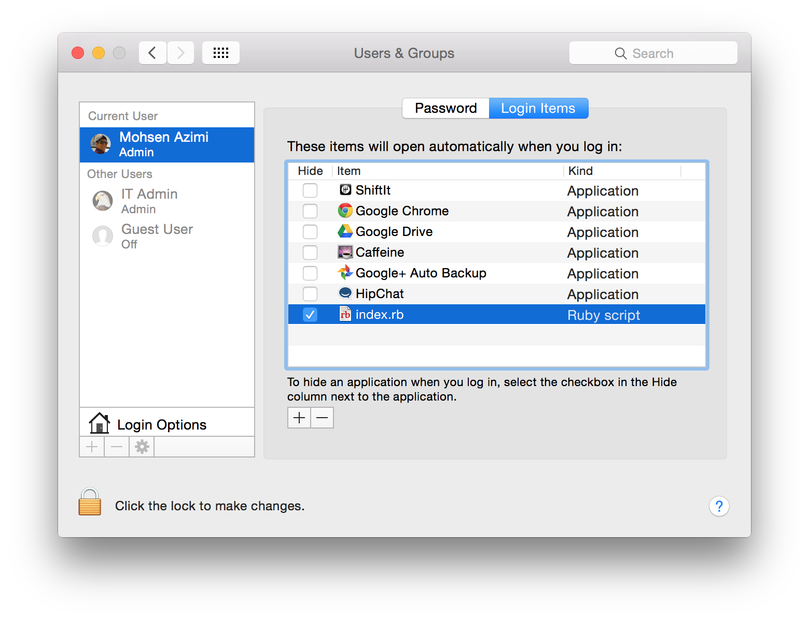

# Github Notification CapsLock Light

> Turn on Mac's keyboard caps lock light when you have notifications on Github.

### How to use

* Install [maclight](https://github.com/busyloop/maclight) gem via **`gem install maclight`**
* Put your Github token in [`token.secret`](./token.secret). It should be a Github API access token that has **notifications** scope.
* Run the following command to run this process in background:

```shell
nohup ruby index.rb &
```

#### Github access token
You can get an access token by going [here](https://github.com/settings/applications) by clicking **Generate new token** button

### Add it to your Login items
If you add this script to you login items it will run every time your machine start ups.



### License
MIT
